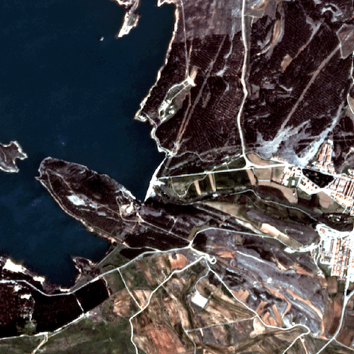

### DynamicEarthNet: Daily Multi-Spectral Satellite Dataset for Semantic Change Segmentation 

Implementation of the CVPR 2022 paper <a href="#!">DynamicEarthNet: Daily Multi-Spectral Satellite Dataset
for Semantic Change Segmentation</a>.



### Abstract 
Earth observation is a fundamental tool for monitoring the evolution of land use in specific areas of interest. 
Observing and precisely defining change, in this context, requires both time-series data and pixel-wise segmentations. To that end, we propose the <em>DynamicEarthNet</em> dataset that consists of daily, multi-spectral satellite observations of 75 selected areas of interest distributed over the globe with imagery from Planet Labs. These observations are paired with pixel-wise monthly semantic segmentation labels of 7 land use and land cover (LULC) classes.
<em>DynamicEarthNet</em> is the first dataset that provides this unique combination of daily measurements and high-quality labels. 
In our experiments, we compare several established baselines that either utilize the daily observations as additional training data (semi-supervised learning) or multiple observations at once (spatio-temporal learning) as a point of reference for future research. 
Finally, we propose a new evaluation metric SCS that addresses the specific challenges associated with time-series semantic change segmentation.

The code has been implemented & tested with Python 3.9.6 and Pytorch 1.9.0.
### Usage 
This repository only contains the implementation of temporal architectures. For the semi-supervised training, we use <a href="https://github.com/dvlab-research/Context-Aware-Consistency">Context Aware Consistency repository</a>. We refer the interested reader there.
The models are mainly adapted from <a href="https://github.com/VSainteuf/utae-paps/tree/2b9fae182f7271cabe59e5837057c7c1b0b40f39">Panoptic Segmentation of Satellite Image Time Series with Convolutional Temporal Attention Networks (ICCV 2021)</a>.

## Datasets and Polar transformation

* Please download the dataset from: <a href="https://mediatum.ub.tum.de/1650201">DynamicEarthNet</a>.
* Find the training, validation and test splits <a href="https://vision.in.tum.de/webshare/u/toker/dynnet_training_splits/">here</a>.
* Put the split files and the data itself in the same directory and replace the root path in `config/defaults.yaml`.
* During the experiments, 2 cubes from the training set was not available so we exclude them. However now they are ready to use, please modify the train.txt accordingly. Specifically, the id's of the missing cubes: 1417_3281_13 and 2235_3403_13.

## Pretrained Models 
* You can find the pretrained models for temporal architectures <a href="/storage/www/user/toker/dynnet_ckpt">here.</a>
## Train 
* Run `utae_train.py`.
* Modify the arguments from `config/defaults.yaml`.
* Additionally, adjust the log files in `helper/parser.py`.
## Test 
To test our architecture use the pretained models, given above, and run  `inference.py`. Modify the checkpoint directory path!
## Cite
If you use our implementation, please cite:
```
@InProceedings{Toker_2022_CVPR,
    author    = {Toker, Aysim and Kondmann, Lukas and Weber, Mark and Eisenberger, Marvin
    and Andres, Camero and Hu, Jingliang and Hoderlein, Ariadna and Senaras, Caglar and Davis, Timothy and Cremers, Daniel and Marchisio, Giovanni and Zhu, Xiaoxiang and Leal-Taixe, Laura},
    title     = {DynamicEarthNet: Daily Multi-Spectral Satellite Dataset for Semantic Change Segmentation},
    booktitle = {Proceedings of the IEEE/CVF Conference on Computer Vision and Pattern Recognition (CVPR)},
    month     = {June},
    year      = {2022}
}
```